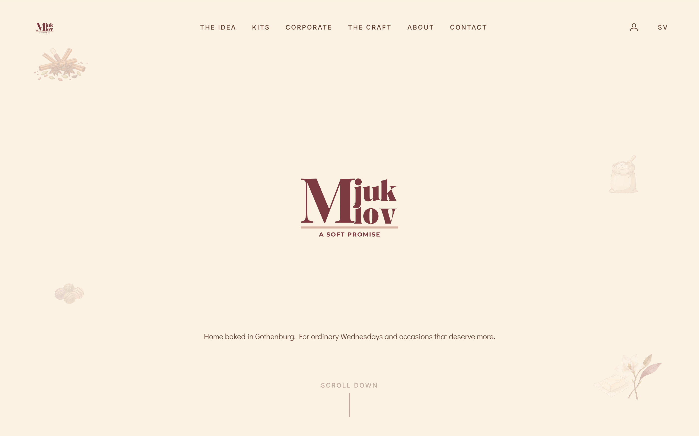
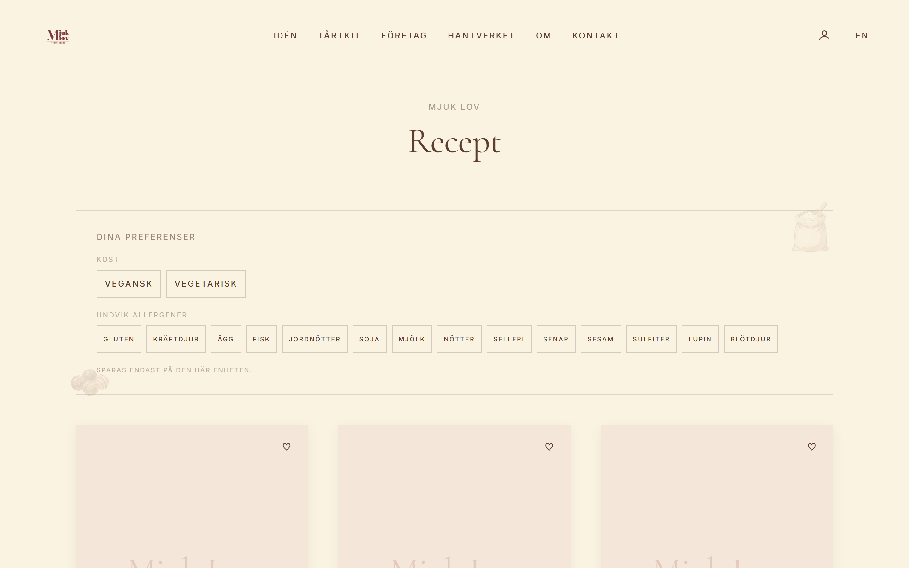
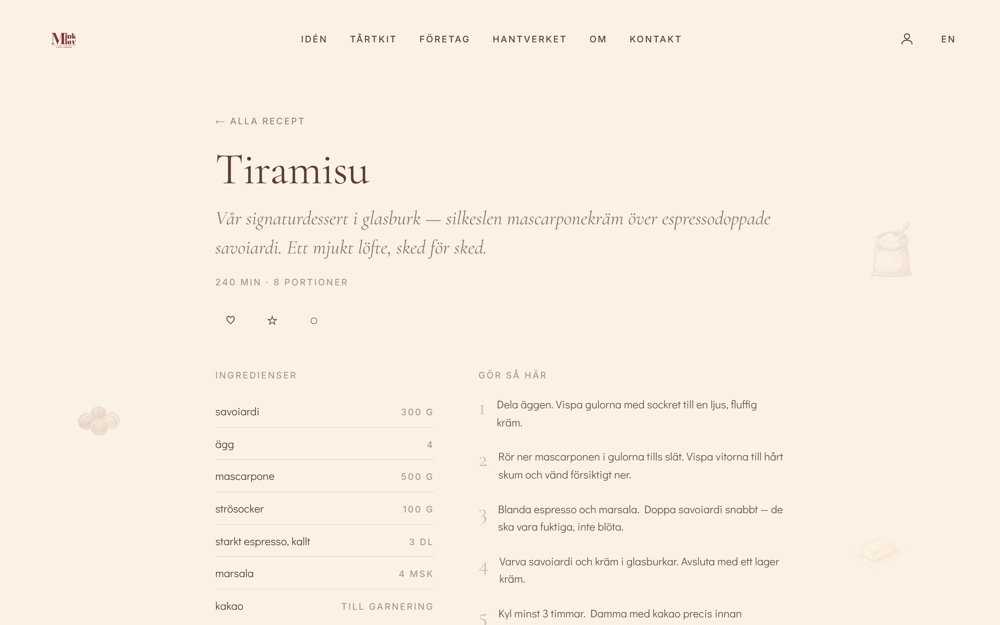
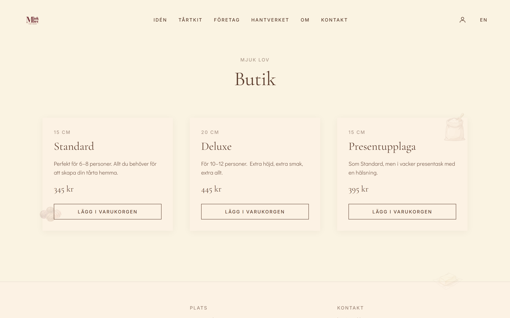

# Mjuk Lov · *ett mjukt löfte*

A bilingual (Swedish / English) website and **AI-powered dessert platform** for a small artisan brand in Gothenburg. It pairs a polished editorial brand site with a 40+ recipe app, customer accounts, an order-management back office, and a no-friction “request to order” shop.

<p>


</p>

> **Portfolio note.** A single repo demonstrating full-stack product work end-to-end: LLM integration *with safety guardrails*, auth + row-level security, an offline-first data layer that syncs to accounts, a real order-management back office with transactional email, third-party API integrations (YouTube Data, Google Places, Stripe, Resend), i18n, SEO, Docker, and CI-free continuous deploy to a custom domain — on a modified **Next.js 16** codebase.

---

## 📸 Screenshots

| Home | Recipes — diet + allergy filter |
|---|---|
|  |  |
| **Recipe** — embedded video, allergen label, AI adapt | **Shop** — DIY cake kits |
|  |  |

---

## 🧰 Tools & integrations

| Area | Tools | What it does here |
|---|---|---|
| **Framework** | Next.js 16 · React 19 · Turbopack | App Router, RSC, Server Actions, SSG + dynamic routes |
| **Language** | TypeScript 5 | End-to-end typed, strict |
| **Styling** | Tailwind CSS v4 · tw-animate-css | Custom editorial design system, zero-radius brand tokens |
| **Database & Auth** | Supabase · PostgreSQL · `@supabase/ssr` | Accounts, email confirm + reset, Row-Level Security, SSR session refresh |
| **AI / LLM** | OpenAI · Anthropic (provider-agnostic) | Baking assistant, recipe adapter, allergen-label drafting |
| **Email** | Resend (DKIM/SPF domain-verified) | Order notifications to the owner + confirm/decline to the customer |
| **Payments** | Stripe (Checkout + webhooks) | Built and parked behind a flag for a future payments phase |
| **External APIs** | YouTube Data API v3 · Google Places API (New) | Resolve official recipe videos · validate delivery addresses |
| **Validation** | Zod | Recipe schema, API payloads, content gate at build time |
| **Testing** | Vitest | Allergen-engine unit tests |
| **Authoring** | `tsx` scripts · Git-as-CMS | Import / translate / label recipes; resolve video IDs |
| **Infra & deploy** | Docker · docker-compose · Vercel · One.com DNS | Standalone container; auto-deploy from `master` to `mjuklov.se` |

---

## ✨ Features

**Recipes (40+, bilingual, SSG)**
- Every recipe is a full page with **embedded YouTube player + ingredients + method + allergen label**, in sv & en.
- **AI-assisted allergen labels** (EU 1169/2011): a hybrid engine — LLM reasoning **+** a deterministic safety-net dictionary + canonical wording — that **drafts** labels for **human approval** (never auto-published).
- **“Make it vegetarian / vegan / gluten-free”** adapter that re-runs the allergen engine on the adapted recipe.
- A **YouTube Data API resolver** script matches each dish to the creator’s *official* channel video and credits it (“inspired by →”).
- `schema.org/Recipe` JSON-LD, `hreflang`, sitemap & robots.

**Personalization (offline-first)**
- Save / wishlist / notes / “made it”, plus a diet + allergy filter.
- Stored **device-local** for guests, then **synced to the account on login** (write-through + merge) — nothing is lost.

**Accounts & ordering**
- Email + password auth with confirmation and reset; show/hide password; a **“My page”** with profile, likes, wishlist, and **order status + history** (active vs past, status badges, confirmed price).
- **Request to order** (no online payment): cart → request form (pickup/delivery, desired date, structured + Google-validated address) → saved to Supabase + emailed.

**Order-management back office (owner-only)**
- `/admin` panel: filter tabs with counts, **accept / decline / mark-done / reopen**, enter a **price quote** + internal note, and **email / call** the customer.
- Status changes flow through an **owner-gated server route** (service role) that also emails the customer on confirm/decline.

---

## 🏗️ Notable engineering decisions

- **AI with guardrails.** The allergen engine combines LLM reasoning (handles “coconut cream ≠ milk”) with a deterministic dictionary (catches what the LLM misses — nuts, gluten) and a human sign-off field — appropriate for a *legal* label. Re-drafting clears the approval.
- **Author-time vs. runtime AI.** Content is generated once at authoring time and served static (≈ zero per-visitor cost); only the personal assistant runs at request time, key server-side, behind a GDPR consent gate.
- **Provider-agnostic AI.** One `chat()` interface; switch OpenAI ↔ Claude with an env var.
- **Offline-first, account-aware data.** A single `lib/userdata` store works for guests (localStorage) and logged-in users (Supabase write-through), with a merge on login.
- **Security model.** Per-user RLS on every table; the **service-role key is used only in server routes** and only after re-verifying the owner — so the back office reads all orders without weakening client-side RLS. `NEXT_PUBLIC_` keys are publishable-only.
- **Resilient by design.** Email is best-effort and never blocks an order; failures are logged, not swallowed. Migrations are idempotent (`add column if not exists`). The app degrades gracefully when an integration’s env var is absent.

---

## 🚀 Getting started

```bash
npm install
cp .env.example .env   # fill in what you need (all optional — see below)
npm run dev            # http://localhost:3000
```

Or with Docker:

```bash
docker compose up -d --build   # http://localhost:3000
```

### Environment variables
See [`.env.example`](.env.example). All optional — the app degrades gracefully:

| Variable | Enables |
|---|---|
| `OPENAI_API_KEY` | AI assistant, recipe adapter, allergen labelling |
| `NEXT_PUBLIC_SUPABASE_URL` / `NEXT_PUBLIC_SUPABASE_PUBLISHABLE_KEY` | Accounts, My page, orders, sync |
| `SUPABASE_SERVICE_ROLE_KEY` | Guest orders, admin reads, webhooks (server-only) |
| `RESEND_API_KEY` / `RESEND_FROM` / `CONTACT_EMAIL` | Transactional email (orders + status) |
| `OWNER_EMAIL` | The account that can reach `/admin` |
| `GOOGLE_MAPS_SERVER_KEY` | Delivery-address autocomplete (Places API New, via a server-side proxy — key never hits the browser) |
| `YOUTUBE_API_KEY` | The author-time video-ID resolver script |
| `STRIPE_SECRET_KEY` / `STRIPE_WEBHOOK_SECRET` | Real payments (parked) |

Database schema lives in [`supabase/migrations/`](supabase/migrations/) — run them in the Supabase SQL editor.

### Scripts
```bash
npm run dev                  # dev server (Turbopack)
npm run build                # production build
npm test                     # Vitest (allergen engine)
npm run label -- <slug>      # AI-draft an allergen label for a recipe
npm run import -- <url>      # AI-import a recipe from a URL
npm run translate -- <slug>  # fill missing sv/en fields
npm run resolve-videos       # match recipes to official YouTube videos (YouTube Data API)
```

---

## 📁 Structure

```
app/                 # App Router: [lang] routes (recept, butik, varukorg, min-sida, admin), api/
app/components/      # recipe / personal / shop / auth / admin + brand UI
lib/                 # recipes, allergen engine, userdata store, cart, ai, supabase, i18n
content/recipes/     # recipe content (JSON, Zod-validated) — git as CMS
scripts/             # author-time AI + YouTube tooling
supabase/migrations/ # SQL schema + RLS
```

---

## 📌 Status

Live at **[mjuklov.se](https://mjuklov.se)** (Vercel, auto-deploy from `master`). Core product — 40+ recipes, personalization, AI, accounts, request-to-order, and the admin back office — is in production. Roadmap: real payments (Stripe un-parked), corporate subscriptions, personalized offers, Persian (RTL) locale.
